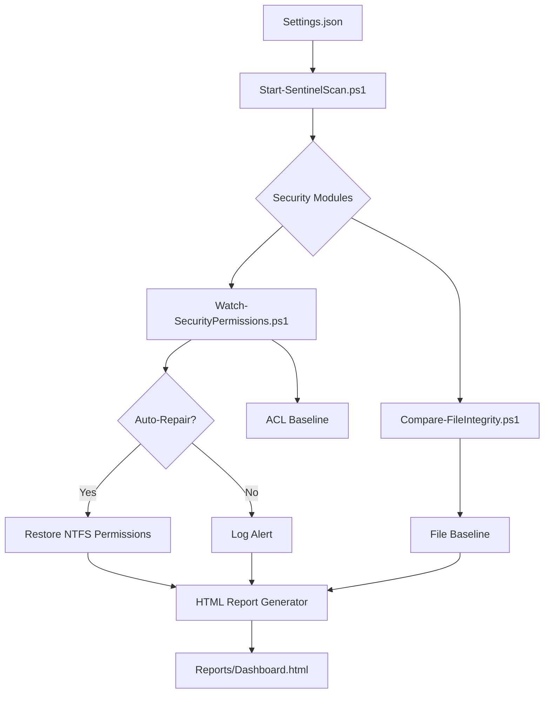

# System Sentinel Framework (PowerShell)

## Oversikt
System Sentinel Framework er et modulært PowerShell-rammeverk utviklet for automatisert overvåking og integritetskontroll av bedriftskritiske systemer. Verktøyet gir systemadministratorer full oversikt over filendringer og rettighetsavvik gjennom et visuelt dashboard og proaktiv logging.

## Systemarkitektur
Dette diagrammet viser hvordan rammeverket henter konfigurasjon, utfører kontroller og genererer utdata:



## Nøkkelfunksjoner
* **Filintegritetskontroll:** Overvåking av filendringer ved bruk av SHA256-hashing for å sikre at filer ikke er manipulert.
* **NTFS Rettighetskontroll:** Deteksjon av uautoriserte endringer i tilgangslister (ACL) via SDDL-analyse.
* **Self-Healing (Aktiv Sikkerhet):** Systemet kan automatisk tilbakestille rettigheter til baseline dersom uautoriserte endringer oppdages.
* **Visuelt Dashboard:** Genererer interaktive HTML-rapporter med Chart.js-visualisering for rask statusoversikt.
* **Enterprise Logging:** Omfattende loggføring til fil med fargekodet terminal-output for sanntids overvåking.
* **Sentralisert Konfigurasjon:** Enkel styring av miljøer via `Settings.json`.

## Demo(Snapshot)


## Prosjektstruktur
* `/Core`: Kjernelogikk for fil- og rettighetsskanning.
* `/Modules`: Rapportgeneratorer og hjelpefunksjoner.
* `/Config`: JSON-konfigurasjon og CSS-maler for rapporter.
* `/Reports`: Ferdige revisjonsrapporter (HTML).
* `/Logs`: Operasjonell loggføring av kjøringer.

## Installasjon & Bruk
1.  Klon repoet til din maskin.
2.  Oppdater `Config/Settings.json` med stiene du ønsker å overvåke.
3.  Kjør initialisering for å opprette baselines:
    ```powershell
    ./Initialize-Sentinel.ps1
    ```
4.  Kjør Master-skriptet som Administrator:
    ```powershell
    ./Start-SentinelScan.ps1
    ```

## Tekniske Krav
* **OS:** Windows 10/11 eller Windows Server.
* **PowerShell:** Versjon 5.1 eller nyere.
* **Rettigheter:** Krever Administrator-privilegier for ACL-skanning.

---
*Utviklet som et verktøy for sikkerhetsrevisjon og automatisert systemovervåking.*
